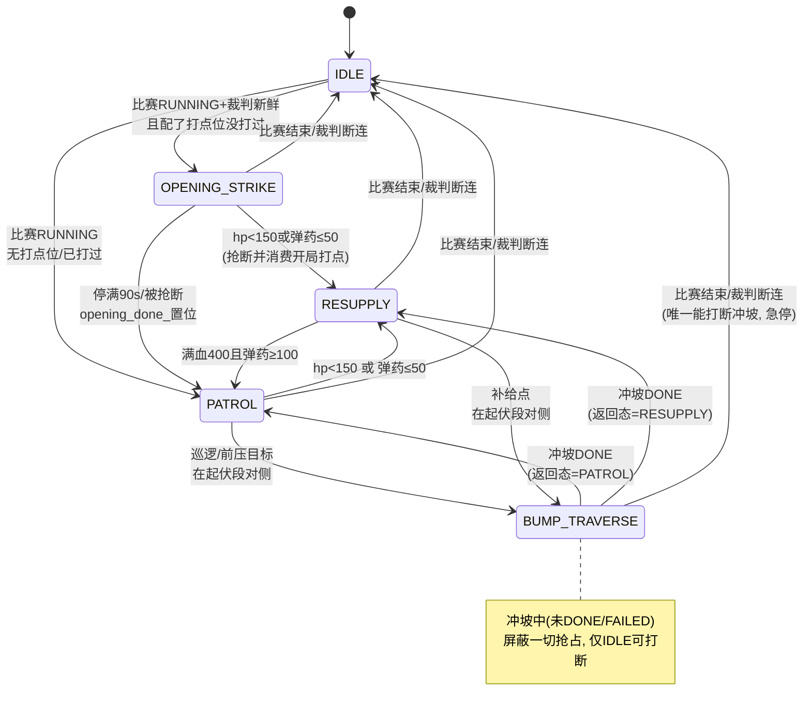

# 决策状态流转图

> omni_decision_sample 顶层状态机的完整流转说明。
> 对应代码：`src/fsm.cpp` 的 `select_state()` / `can_leave_current_state()` / `behave_*()`。
> 最后更新：2026-07-16 | 五态：IDLE / OPENING_STRIKE / BUMP_TRAVERSE / PATROL / RESUPPLY

---

## 一、优先级链（每 tick 从上往下评估，命中第一个就返回）

```
优先级              触发条件                                 说明
─────────────────────────────────────────────────────────────────────────
① IDLE            裁判数据失效(>3s) 或 比赛未运行            唯一能打断冲坡的状态(急停)
② BUMP_TRAVERSE   正在冲坡(未 DONE/FAILED)                  冲坡中屏蔽②以下所有抢占
③ RESUPPLY        hp<150 或 弹药≤50                         血弹优先,会抢断开局打点
④ OPENING_STRIKE  开局 + 配了打点位 + 本局没打过            每局一次,打完/被抢断即消费
⑤ PATROL          以上都不满足(默认)                        按我方前哨站状态选路线
                  └→ 若目标在起伏段对侧 → 进 BUMP_TRAVERSE
```

关键点：**BUMP_TRAVERSE 有两个入口**——
- 作为"正在进行"的高优先级状态（②）：一旦在冲坡就赖着不走
- 作为业务状态（RESUPPLY/PATROL）**触发出来**的穿越动作（⑤下的分支）：走到起伏段对侧就接管

---

## 二、顶层状态流转图（ASCII）

```
                      ┌──────────────────────────────────────────┐
                      │  比赛未运行 / 裁判断连(>3s)                 │
                                                       ▼                                            │
                 ┌─────────┐   比赛RUNNING & 裁判新鲜               │
        ┌───────▶│  IDLE   │──────────────┐                        │
        │        └─────────┘              │                        │
        │         取消所有导航                                ▼                        │
        │                          配了opening_strike               │
        │                          且本局没打过?                    │
        │                        ┌──────┴───────┐                  │
        │                       是                                 否                 │
        │                        ▼                                 ▼                 │
        │              ┌──────────────────┐   (进入业务判定)         │
        │  hp/弹药低    │  OPENING_STRIKE  │        │               │
        │  抢断并消费   │  去打点位停90s    │        │               │
        │◀─────────────│  打敌方前哨站     │        │               │
        │              └────────┬─────────┘        │               │
        │                       │ 停满90s / 被抢断  │               │
        │                       │ → opening_done_   │               │
        │                       ▼                                              ▼               │
        │              ┌────────────────────────────────────┐      │
        │  裁判断连     │         业务状态判定                 │      │
        └──────────────│  (RESUPPLY / PATROL, 每tick重算)     │      │
                       └───┬───────────────────────┬─────────┘      │
                    hp/弹药低│                       │有血有弹        │
                                                                     ▼                                                         ▼               │
                   ┌───────────────┐        ┌──────────────┐        │
                   │  RESUPPLY     │        │   PATROL     │        │
                   │  回补给区回血  │        │  巡逻/前压    │        │
                   └───┬───────────┘        └──────┬───────┘        │
                       │ 满血且弹药≥100             │                │
                       └────────────▶ PATROL       │                │
                       │                            │                │
                                         目标在起伏段对侧?             目标在起伏段对侧?          │
                       │                            │                │
                       └──────────┬─────────────────┘                │
                                                                                      ▼                                  │
                       ┌──────────────────────┐                     │
                       │   BUMP_TRAVERSE       │  冲坡中: 除IDLE      │
                       │   舵轮直线开环冲过     │  外不可打断 ────────┘
                       └──────────┬───────────┘
                             DONE │ 交还进入前的业务状态
                                                                                   ▼
                       (回 RESUPPLY 或 PATROL)
```

---

## 三、顶层状态流转图（Mermaid，支持渲染的环境更清晰）



---

## 四、BUMP_TRAVERSE 内部子状态机（BumpPhase）

进入 BUMP_TRAVERSE 后，内部按 5 个子阶段推进（`behave_bump_traverse`）：

```
   进入 BUMP_TRAVERSE
        │
                   ▼
  ┌──────────────┐   发Nav2 goal到入口(带yaw对正)
  │  GOTO_ENTRY  │   到达入口附近(entry_radius内)?
  └──────┬───────┘         Nav2失败→重试1次
         │到达入口
                      ▼ cancel Nav2
  ┌──────────────┐   发零速, 等 align_time(0.5s)
  │    ALIGN     │   (舵轮转正 + 速度链路排空)
  └──────┬───────┘
         │对齐完成
                     ▼
  ┌──────────────┐   恒速 dash_speed 直冲(纯linear.x)
  │   DASHING    │──────────┐
  └──────┬───────┘          │超时(20s)
         │越过出口x           ▼
         │硬停          ┌──────────────┐  反向低速退回入口
                      ▼              │   FAILED     │  退回成功→标记该段本局禁用
  ┌──────────────┐      └──────┬───────┘
  │    DONE      │             │
  │  发几帧零速   │             │
  └──────┬───────┘             │
         └──────────┬──────────┘
                                                 ▼
         交还业务状态(bump_return_state_)
         DONE→正常返回;  FAILED→返回但该段禁用
```

### DASHING 阶段每 tick 的判断顺序

1. **超时**（`now-start > bump_timeout_s`，默认20s）→ 转 FAILED（反向退回）
2. **定位/TF 丢失**（`!sentry_pos_valid()`）→ 保持上一帧速度**盲走**，不停车（停=卡波谷）
3. **越过出口 x**（单轴单边比较，容差 `bump_tol`）→ 硬停转 DONE
4. 都不满足 → 恒速 `bump_dash_speed` 继续冲（**不减速**，波浪靠冲量翻越）

### 方向自动判定（进入 BUMP_TRAVERSE 时定一次）

哨兵在起伏段哪一侧就往对侧冲：
- 在低 x 侧 → 往高 x 冲（FORWARD 或 BACKWARD 取决于 exit 在哪端）
- `vx` 符号 = `sign(dash_target.x - entry.x)`，恒速直到越过目标 x
---

## 五、一局比赛的典型时序（前压战术）

```
比赛开始
   │
   ▼
① OPENING_STRIKE ── 去打点位, 停90s让自瞄打敌方前哨站
   │                (读不到敌方前哨血量, 靠固定时长, 不是确认摧毁)
   │ 停满90s / 中途血弹不足被抢断 → opening_done_置位
   ▼
② 判定我方前哨站状态 (每tick持续判, 不是一次性)
   │
   ├─ 我方前哨存活 ──▶ PATROL 走 patrol_aggressive (前压路线)
   │                     │
   │                     │ 前压点在起伏段对侧
   │                     ▼
   │                  BUMP_TRAVERSE 正向冲过起伏段 ──▶ 到高地侧前压
   │                     │
   │                     │ 前压途中若我方前哨被打掉
   │                     └──▶ 下一tick切回 patrol(防守), 目标在己方半场
   │                          → 若在高地侧, 会反向冲起伏段撤回 ⚠️见风险
   │
   └─ 我方前哨被摧毁 ──▶ PATROL 走 patrol (防守路线, 我方半场)

  任意时刻 hp<150 或 弹药≤50:
   └──▶ RESUPPLY 回补给区 (若补给点在起伏段对侧, 反向冲过去)
        回满400且弹药≥100 → 出来, 按当前前哨状态重选前压/防守
```

### 关键衔接点（易误解，务必看）

| 你的理解 | 代码实际 | 差异 |
|----------|----------|------|
| "打完前哨站" | 停满90s或被抢断, 非确认摧毁 | 读不到敌方前哨血量 |
| "接收到我方前哨存活" | 每tick持续判 outpost_alive() | 不是一次性, 前哨中途死了立刻切防守 |
| "前压中过起伏" | 目标在段对侧就过, 与前压状态解耦 | 靠"前压点配在段对侧"实现绑定 |
| 残血撤退过起伏 | RESUPPLY 也会触发 BUMP_TRAVERSE | 双向复用同一段 |
| 开局打点会过起伏吗 | 不会, 代码强制排除 OPENING_STRIKE | 打点位在己方半场 |

---

## 六、优先级与抢占规则速查

| 当前状态 | 能被谁打断 | 不能被谁打断 |
|----------|-----------|-------------|
| IDLE | — | 随时可离开(比赛恢复即走) |
| OPENING_STRIKE | IDLE, RESUPPLY(血弹不足, 抢断即消费) | PATROL |
| PATROL | IDLE, RESUPPLY, BUMP触发 | — |
| RESUPPLY | IDLE, BUMP触发(撤退过坡) | 血弹没恢复满前不主动退出 |
| **BUMP_TRAVERSE** | **仅 IDLE**(比赛结束/断连急停) | **受击/血弹不足/一切其他** |

- **min_ticks_in_state**：非抢占类的普通切换要停满4 tick(400ms)防抖；RESUPPLY抢断PATROL、IDLE、BUMP触发都不受此限。
- **冲坡抢占屏蔽是两层**：select_state 强制返回 BUMP + can_leave_current_state 拒绝离开。冗余纵深，任意一层失效另一层兜底。

---

## 七、⚠️ 战术风险提示（非代码bug，需人工判断）

**前压途中前哨被摧毁 → 反向撤回可能危险**：
若哨兵已冲过起伏段到高地侧前压，此时我方前哨被打掉 → 切防守路线(己方半场) → 为回防守点会**反向冲起伏段撤回**。这个撤回动作本身正确，但高地侧撤退时可能正暴露在敌方火力下。这是战术层面要权衡的：起伏段坐标和前压/防守点的配置，要考虑"最坏情况下反向撤回是否安全"。代码只保证"能过"，不判断"该不该过"。

**开环冲坡是物理安全风险**：冲坡期决策直发 cmd_vel_chassis 驱动底盘，绕过 Nav2 避障。上车前必须平地假坎验证全流程、dash_speed 从低速起、留 IDLE 急停(见 实车测试指南.md 4.5节)。


